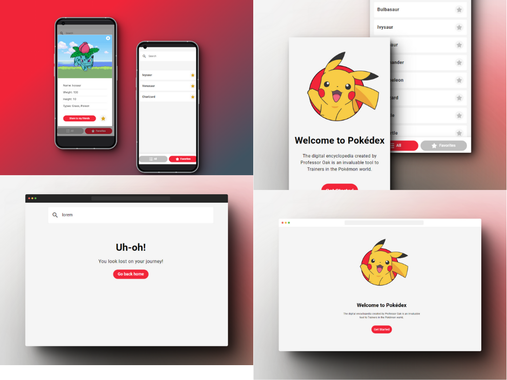

# Pokedex App

### Demo

[https://pokedex-jd.netlify.app/#/](https://pokedex-jd.netlify.app/#/)

### Descripción del proyecto

La Pokédex es una aplicación web que te permite explorar el mundo de los Pokémon y conocer detalles sobre varios Pokémon, incluyendo sus nombres, tipos, habilidades y estadísticas.

### Capturas



## Notas de configuración

Para desarrollo local: `npx run dev`

## Estructura del Proyecto

```bash
|-root
  |-src
    |-api # Configuracion de axios para interactuar con la API PokeApi
    |-boot
      |-global-main.js # Instalacion y configuración de Tan Stack
    |-components
      |-BaseButton.vue
      |-BaseContainer.vue
      |-BaseLoading.vue
      |-CloseIcon.vue
      |-FooterButtons.vue
      |-ListIcon.vue
      |-NotFound.vue
      |-PokemonCard.vue
      |-PokemonModal.vue
      |-SearchPokemon.vue
      |-StarIcon.vue
    |-composables ## Lógica con estado global
    |-css
      |-app.scss # Estilo global
      |-quasar.variables.scss # Tema personalizado de Material UI
    |-layouts # Layout principal
    |-pages # Páginas
      |-indexPage.vue # Home
      |-PokemonList # Listado de Pokemones con el buscador
    |-router ## Configuración de Vue Router
    |-stores
      |-index.js ## Archivo de configuración de Pinia
      |-pokemons.js ## Store global de la app
```

La lógica principal de la aplicación está centrada en los dos composables creados, que al momento de su instancia hacen el llamado a la API para obtener el listado o detalle de los Pokémon y se guarda en caché, optimizando así la experiencia de usuario y el tiempo de carga en la página.

Intencionalmente cada llamada a la API tiene una sleep function de 2 s, esto para poder mostrar el status de la web cuando está haciendo la petición http.

Estos son los [composables](https://vue3-spanish.netlify.app/guide/reusability/composables.html#%C2%BFque-es-un-composable) antes mencionados:

- [`usePokemons`](src/composables/usePokemons.js) - Lista todos los pokemons y los que el usuario establezca como favoritos.
- [`usePokemon`](src/composables/usePokemon.js) - Consulta los detalles del pokemon por su nombre.

## TODOs (Tareas pendientes)

Debido al tiempo limitado para la realización de la prueba, algunas funcionalidades y requerimientos quedaron pendientes:

- [ ] Suite de pruebas
- [ ] Buscar Pokemons que no esten en el listado

---

## Dependencias principales

- [Vue.js](<https://github.com/jwtk/jjwt](https://vuejs.org/)>) - Un marco accesible, eficaz y versátil para crear interfaces de usuario web.
- [Quasar Framework](https://quasar.dev/) - Material UI para el desarrollo de aplicaciones web y móviles con Vue.js
- [Pinia](https://es-pinia.vercel.app/) - Administrador de estado avanzado para aplicaciones Vue.js.
- [Axios](https://modelmapper.org/) - Cliente HTTP basado en promesas para el navegador
- [TanStack Query V4](https://tanstack.com/query/latest) - Gestor de estado asíncrono
- [Vue Router](https://router.vuejs.org/) - Router oficial de Vue.js
